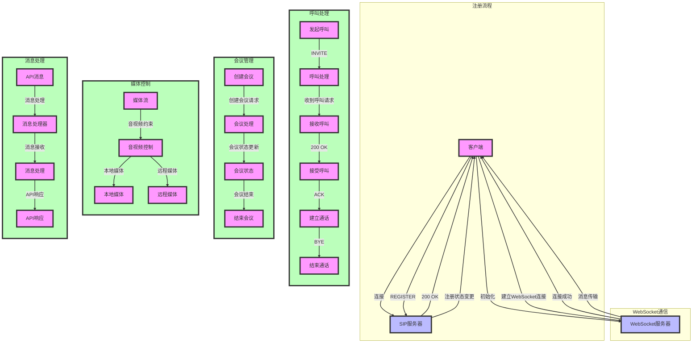

# SIP.js 调用响应流程图

```mermaid
graph TB
    %% 设置图表方向和大小
    %% 使用更大的图表尺寸
    classDef default fill:#f9f,stroke:#333,stroke-width:4px,font-size:16px;
    classDef server fill:#bbf,stroke:#333,stroke-width:4px,font-size:16px;
    classDef process fill:#bfb,stroke:#333,stroke-width:4px,font-size:16px;

    %% 客户端初始化和连接
    Client[客户端] --> |初始化| WebSocket[WebSocket服务器]
    Client --> |连接| SIPServer[SIP服务器]

    %% 注册流程
    subgraph Register[注册流程]
        direction TB
        Client --> |REGISTER| SIPServer
        SIPServer --> |200 OK| Client
        SIPServer --> |注册状态变更| Client
    end

    %% WebSocket通信
    subgraph WebSocketFlow[WebSocket通信]
        direction TB
        Client --> |建立WebSocket连接| WebSocket
        WebSocket --> |连接成功| Client
        WebSocket --> |消息传输| Client
    end

    %% 呼叫流程
    subgraph Call[呼叫处理]
        direction TB
        MakeCall[发起呼叫] --> |INVITE| CallHandler[呼叫处理]
        CallHandler --> |收到呼叫请求| IncomingCall[接收呼叫]
        IncomingCall --> |200 OK| CallAccept[接受呼叫]
        CallAccept --> |ACK| CallEstablished[建立通话]
        CallEstablished --> |BYE| CallEnd[结束通话]
    end

    %% 会议管理
    subgraph Conference[会议管理]
        direction TB
        CreateConf[创建会议] --> |创建会议请求| ConfHandler[会议处理]
        ConfHandler --> |会议状态更新| ConfState[会议状态]
        ConfState --> |会议结束| ConfEnd[结束会议]
    end

    %% 媒体控制
    subgraph Media[媒体控制]
        direction TB
        MediaStream[媒体流] --> |音视频约束| AudioVideo[音视频控制]
        AudioVideo --> |本地媒体| LocalMedia[本地媒体]
        AudioVideo --> |远程媒体| RemoteMedia[远程媒体]
    end

    %% 消息处理
    subgraph Message[消息处理]
        direction TB
        APIMessage[API消息] --> |消息处理| MessageHandler[消息处理器]
        MessageHandler --> |消息接收| MessageProcess[消息处理]
        MessageProcess --> |API响应| APIResponse[API响应]
    end

    %% 组件样式定义
    class SIPServer,WebSocket server;
    class Call,Conference,Media,Message process;

    %% 连接线样式
    linkStyle default stroke-width:2px;
```
