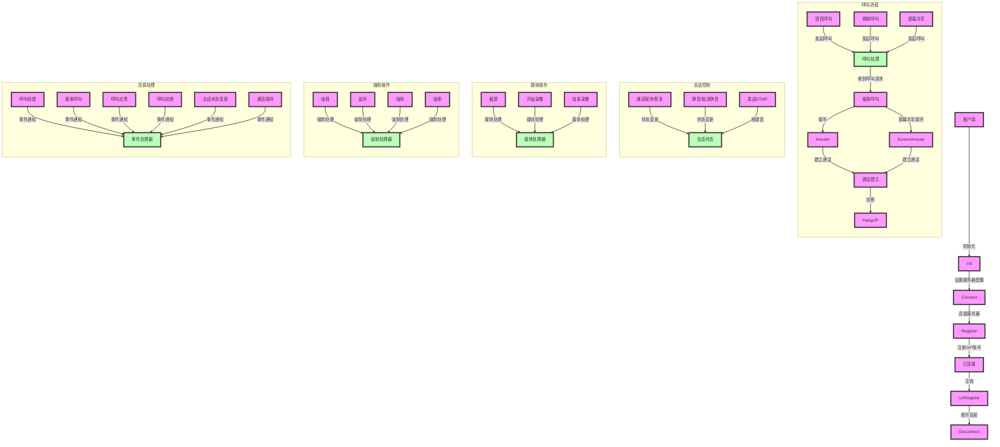

# SIP.js 调用响应流程图

```mermaid
graph TB
    %% 设置图表方向和大小
    classDef default fill:#f9f,stroke:#333,stroke-width:4px,font-size:16px;
    classDef server fill:#bbf,stroke:#333,stroke-width:4px,font-size:16px;
    classDef process fill:#bfb,stroke:#333,stroke-width:4px,font-size:16px;

    %% 客户端初始化和连接
    Client[客户端] --> |初始化| Init[Init]
    Init --> |设置服务器配置| Connect[Connect]
    Connect --> |连接服务器| Register[Register]
    Register --> |注册SIP账号| Connected[已连接]
    Connected --> |注销| UnRegister[UnRegister]
    UnRegister --> |断开连接| Disconnect[Disconnect]

    %% 音视频呼叫流程
    subgraph CallFlow[呼叫流程]
        direction TB
        AudioCall[语音呼叫] --> |发起呼叫| CallHandler[呼叫处理]
        VideoCall[视频呼叫] --> |发起呼叫| CallHandler
        MakeScreenCall[屏幕共享] --> |发起呼叫| CallHandler
        CallHandler --> |收到呼叫请求| IncomingCall[接收呼叫]
        IncomingCall --> |接听| Answer[Answer]
        IncomingCall --> |屏幕共享接听| ScreenAnswer[ScreenAnswer]
        Answer --> |建立通话| CallEstablished[通话建立]
        ScreenAnswer --> |建立通话| CallEstablished
        CallEstablished --> |挂断| HangUP[HangUP]
    end

    %% 会话控制
    subgraph SessionControl[会话控制]
        direction TB
        HoldChange[通话保持/恢复] --> |状态变更| SessionState[会话状态]
        MuteChange[静音/取消静音] --> |状态变更| SessionState
        SendDtmf[发送DTMF] --> |按键音| SessionState
    end

    %% 媒体操作
    subgraph MediaOps[媒体操作]
        direction TB
        takephoto[截屏] --> |媒体处理| MediaHandler[媒体处理器]
        startrecord[开始录像] --> |媒体处理| MediaHandler
        stoprecord[结束录像] --> |媒体处理| MediaHandler
    end

    %% 强制操作
    subgraph ForceOps[强制操作]
        direction TB
        froceOPInterpose[强插] --> |强制处理| ForceHandler[强制处理器]
        froceOPMonitor[监听] --> |强制处理| ForceHandler
        froceOPRemoveOther[强拆] --> |强制处理| ForceHandler
        froceOPRemove[强断] --> |强制处理| ForceHandler
    end

    %% 回调处理
    subgraph Callbacks[回调处理]
        direction TB
        onCallCreated[呼叫创建] --> |事件通知| EventHandler[事件处理器]
        onCallReceived[接收呼叫] --> |事件通知| EventHandler
        onCallAnswered[呼叫应答] --> |事件通知| EventHandler
        onCallHangup[呼叫挂断] --> |事件通知| EventHandler
        onSessionStateChange[会话状态变更] --> |事件通知| EventHandler
        onCallHold[通话保持] --> |事件通知| EventHandler
    end

    %% 组件样式定义
    class Client,Init,Connect,Register,UnRegister,Disconnect default;
    class CallHandler,SessionState,MediaHandler,ForceHandler,EventHandler process;

    %% 连接线样式
    linkStyle default stroke-width:2px;
```
