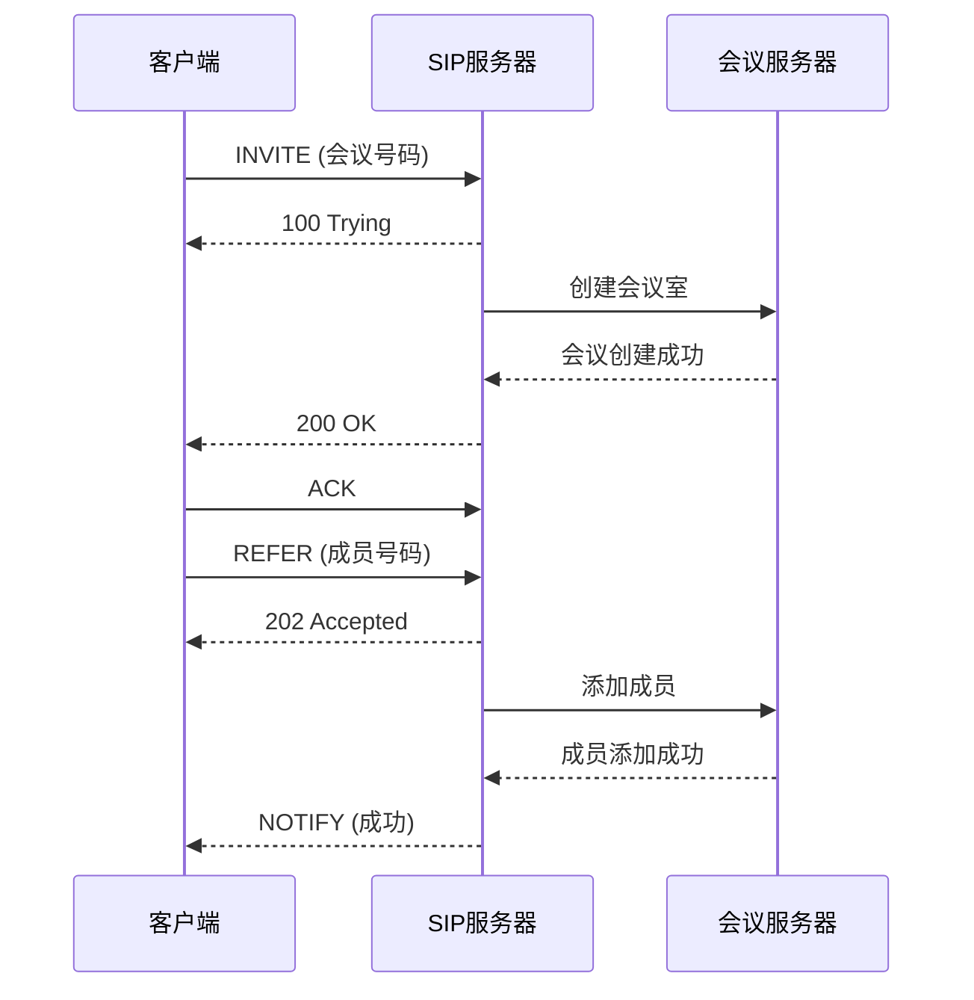
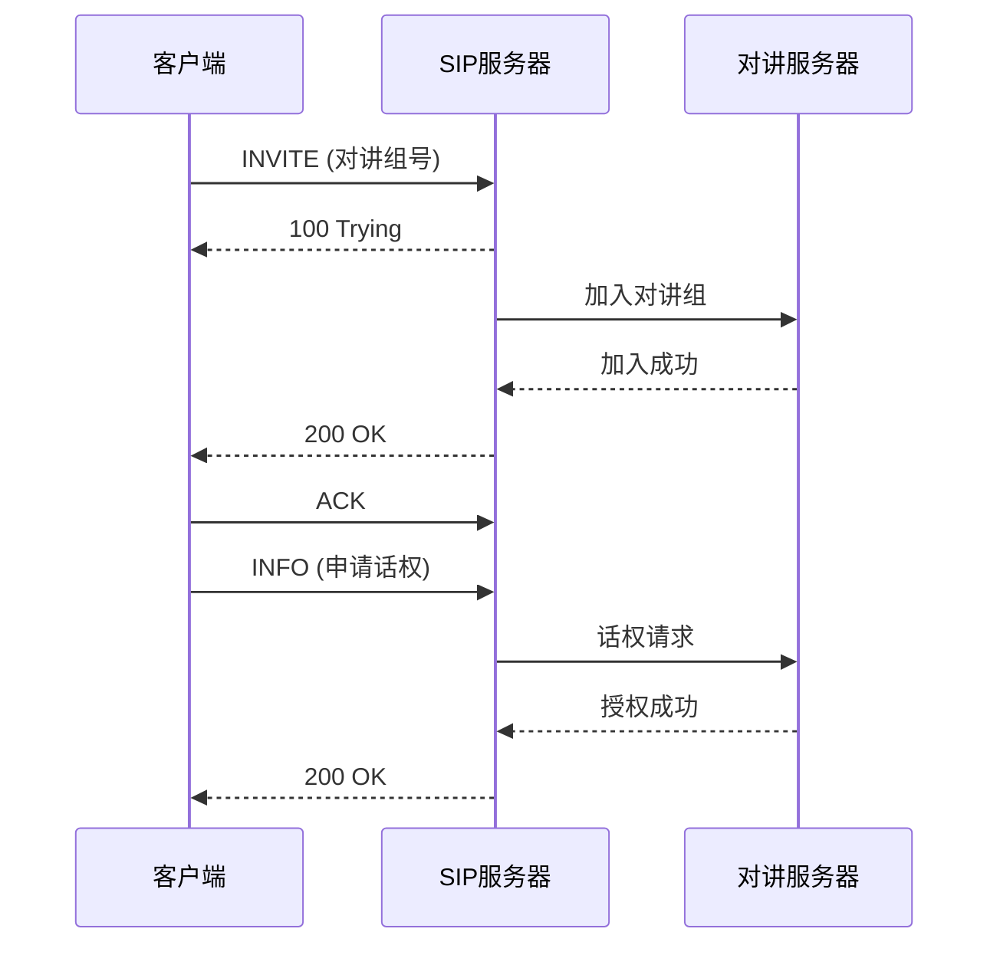
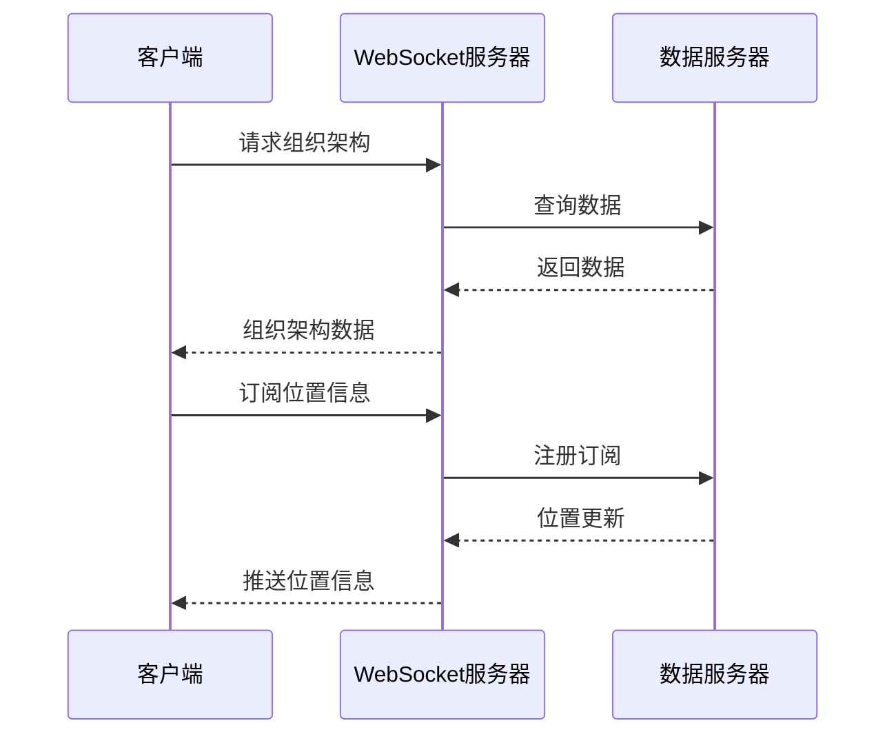

# 功能模块调用流程图

## 1. 会议功能流程

```mermaid
sequenceDiagram
    participant Client as 客户端
    participant SIP as SIP服务器
    participant Conf as 会议服务器

    %% 创建会议
    Client->>SIP: INVITE (会议号码)
    SIP-->>Client: 100 Trying
    SIP->>Conf: 创建会议室
    Conf-->>SIP: 会议创建成功
    SIP-->>Client: 200 OK
    Client->>SIP: ACK

    %% 邀请成员
    Client->>SIP: REFER (成员号码)
    SIP-->>Client: 202 Accepted
    SIP->>Conf: 添加成员
    Conf-->>SIP: 成员添加成功
    SIP-->>Client: NOTIFY (成功)
```

## 2. 对讲功能流程

```mermaid
sequenceDiagram
    participant Client as 客户端
    participant SIP as SIP服务器
    participant PTT as 对讲服务器

    %% 加入对讲组
    Client->>SIP: INVITE (对讲组号)
    SIP-->>Client: 100 Trying
    SIP->>PTT: 加入对讲组
    PTT-->>SIP: 加入成功
    SIP-->>Client: 200 OK
    Client->>SIP: ACK

    %% 申请话权
    Client->>SIP: INFO (申请话权)
    SIP->>PTT: 话权请求
    PTT-->>SIP: 授权成功
    SIP-->>Client: 200 OK
```

## 3. 数据获取流程

```mermaid
sequenceDiagram
    participant Client as 客户端
    participant WS as WebSocket服务器
    participant DB as 数据服务器

    %% 获取组织架构
    Client->>WS: 请求组织架构
    WS->>DB: 查询数据
    DB-->>WS: 返回数据
    WS-->>Client: 组织架构数据

    %% 获取成员位置
    Client->>WS: 订阅位置信息
    WS->>DB: 注册订阅
    DB-->>WS: 位置更新
    WS-->>Client: 推送位置信息
```
