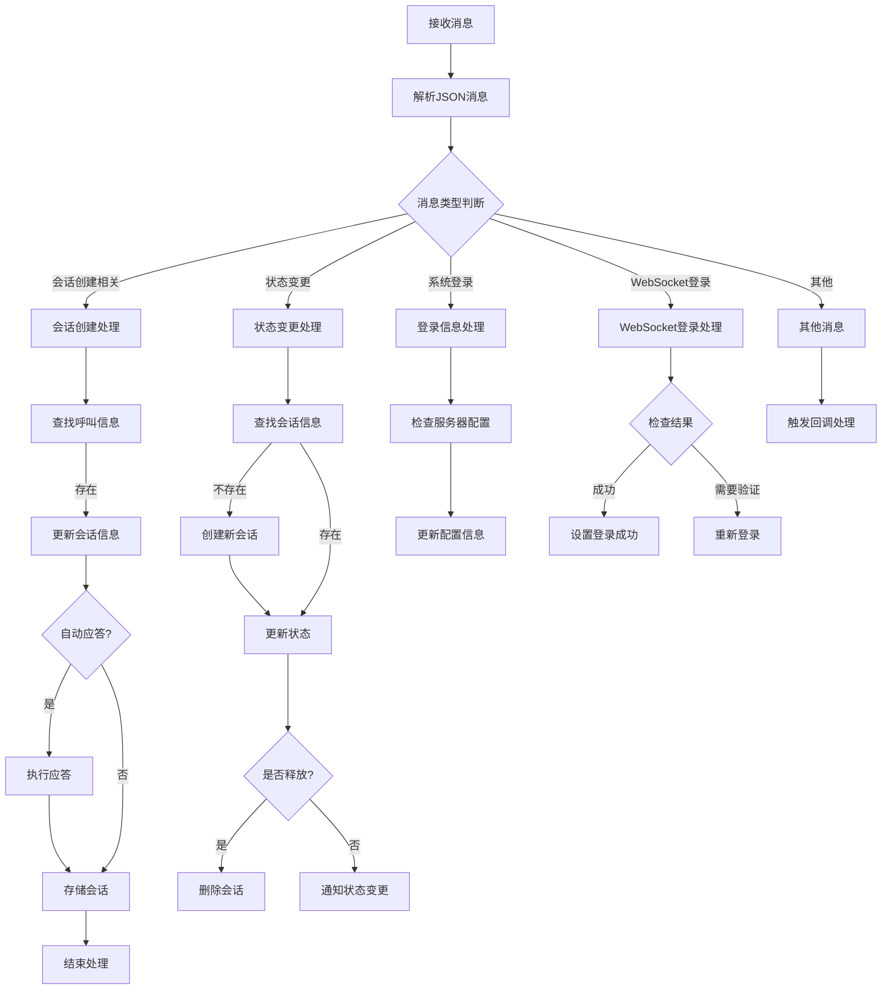
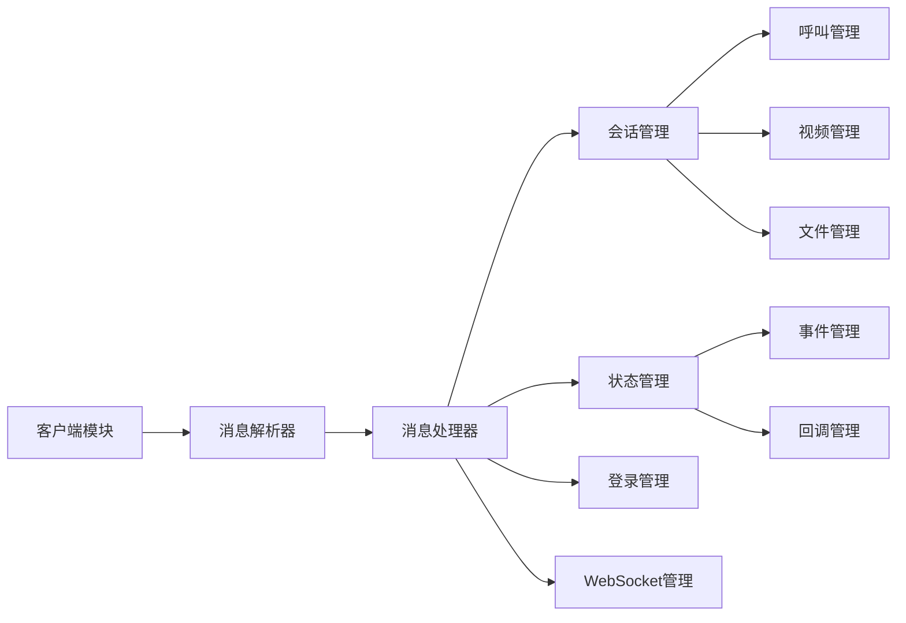

# SIP.js 消息处理流程图

## 消息处理总体流程



## 核心功能模块



## 消息类型和处理流程

1. 会话创建消息
   - 普通呼叫创建 (API_SESSION_CREATECALLCB)
   - 视频通话创建 (API_SESSION_CREATEVIDEOBUGCB)
   - 文件播放创建 (API_SESSION_CREATEPLAYFILECALLCB)
   - 发言申请创建 (API_SESSION_APPLYSPEAKCB)
   - 视频转接创建 (API_OPERATE_TRANSFER_VIDEOCB)

2. 会话状态消息
   - 状态变更通知 (EventSessionStateChange)
   - 会话创建、更新、释放处理
   - 状态回调通知

3. 系统登录消息
   - 服务器配置更新
   - 扩展服务器配置处理
   - 默认配置回退处理

4. WebSocket登录消息
   - 登录结果处理
   - 密码验证处理
   - 登录状态更新

## 关键数据结构

1. 会话信息 (MakeCallInfo)

   ```typescript
   interface MakeCallInfo {
       callid?: string;     // 呼叫ID
       cid: string;         // 会话ID
       autoanswer: boolean; // 自动应答标志
       ctype?: CallType;    // 呼叫类型
       state?: CallState;   // 呼叫状态
       // ... 其他字段
   }
   ```

2. 会话管理映射表

   ```typescript
   // 待处理呼叫映射表
   Map<string, MakeCallInfo> arrMakeCalls

   // 活动会话映射表
   Map<string, MakeCallInfo> arrSessions
   ```
