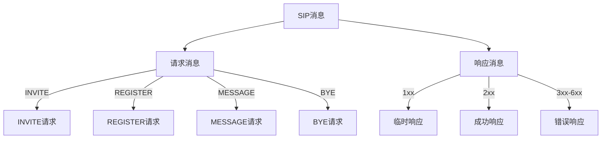
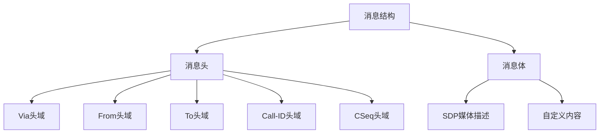
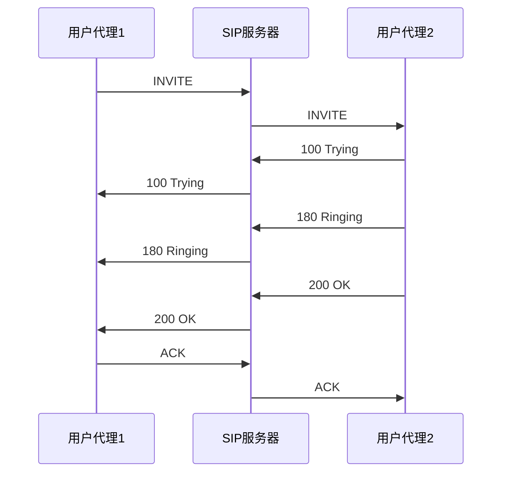
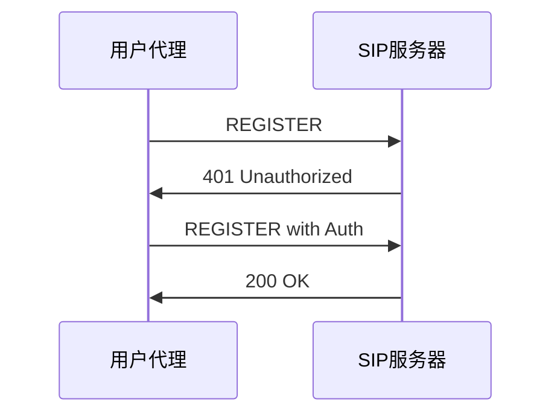
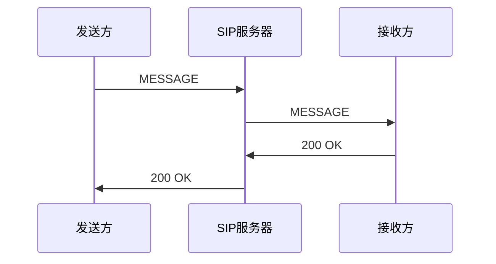
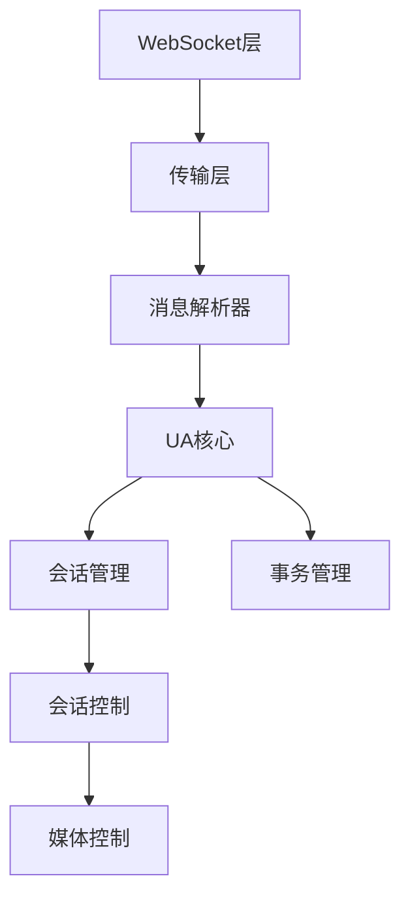
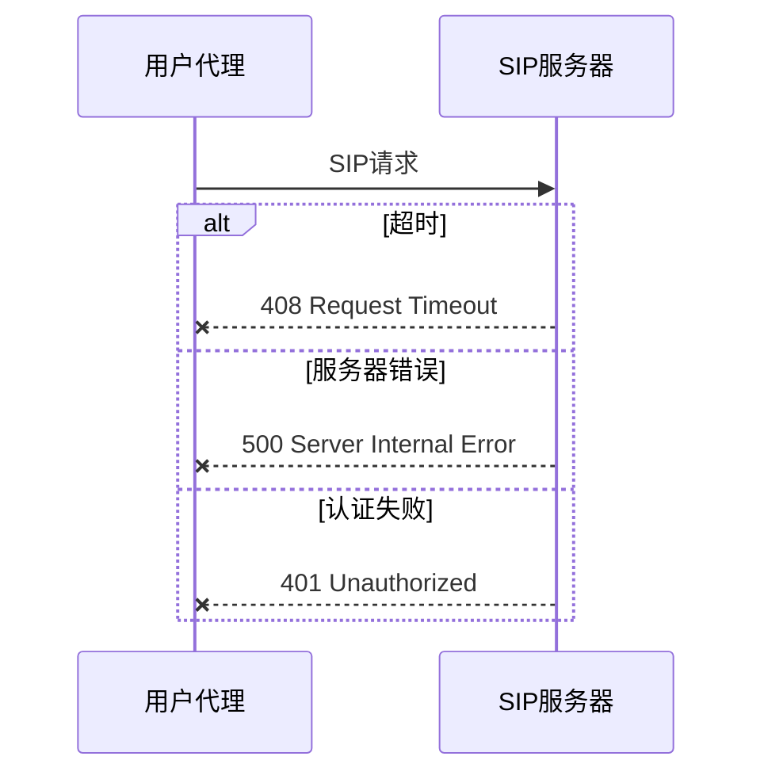

# SIP消息处理流程图

## 消息类型和结构

### 1. 基础消息类型



### 2. 消息结构



## 消息处理流程

### 1. 呼叫建立流程



### 2. 注册流程



### 3. 消息发送流程



## 核心组件交互



## 错误处理流程



## 关键代码注释

### 1. 消息处理回调

```typescript
// 处理接收到的SIP消息
function onMessageReceived(message: string) {
    // 1. 解析消息类型
    // 2. 根据消息类型分发处理
    // 3. 执行相应的业务逻辑
    // 4. 返回处理结果
}
```

### 2. 会话状态管理

```typescript
// 会话状态变更处理
function handleSessionState(session: Session) {
    // 1. 检查会话状态
    // 2. 更新内部状态
    // 3. 触发相应的事件
    // 4. 执行状态相关的操作
}
```

## 最佳实践

1. 消息处理
   - 始终验证消息的完整性
   - 实现适当的错误处理机制
   - 保持消息处理的异步性

2. 状态管理
   - 维护清晰的状态机制
   - 处理所有可能的状态转换
   - 实现状态恢复机制

3. 性能优化
   - 优化消息解析过程
   - 实现消息缓存机制
   - 控制并发连接数量
